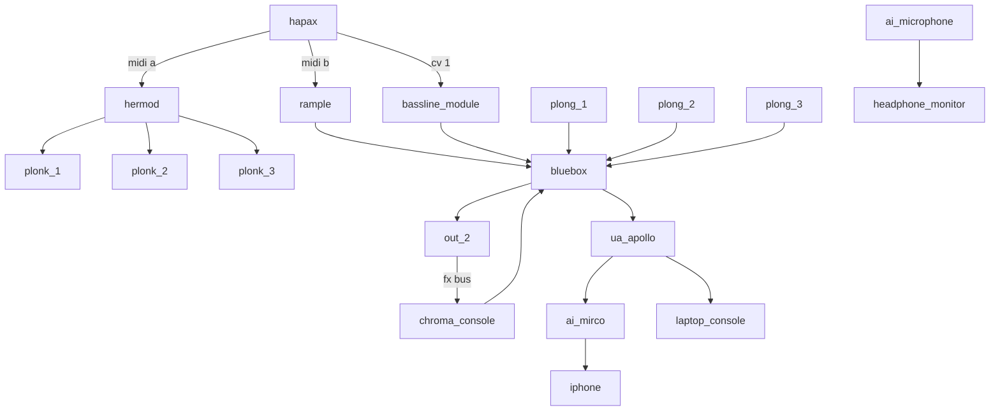

# diagrams

## dawless rig

```mermaid
graph TD
hapax -- midi a --> hermod
hapax -- midi b --> rample 
hapax -- cv 1 --> bassline_module 
hermod --> plonk_1
hermod --> plonk_2
hermod --> plonk_3
rample --> bluebox
bassline_module --> bluebox
plong_1 --> bluebox
plong_2 --> bluebox
plong_3 --> bluebox
chroma_console --> bluebox
bluebox --> out_2
out_2 -- fx bus --> chroma_console
bluebox --> ua_apollo --> ai_mirco --> iphone
ua_apollo --> laptop_console
ai_microphone --> headphone_monitor
```
