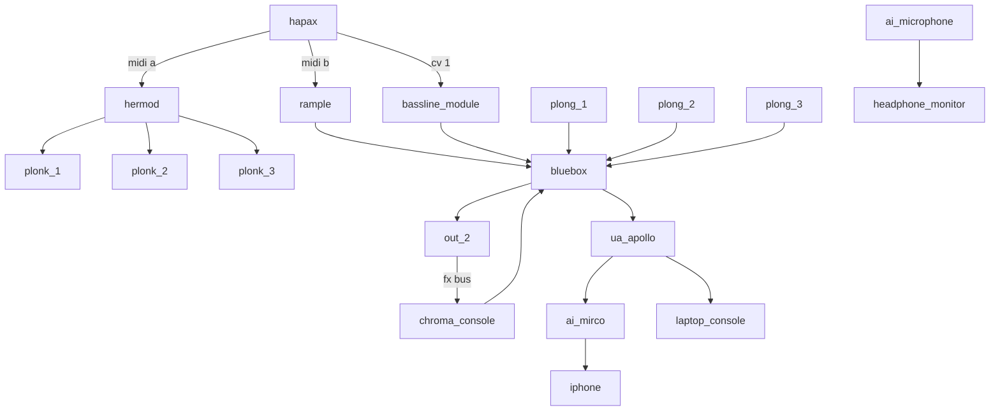

## music

<iframe width="1109" height="693" src="https://www.youtube.com/embed/diNsNloGs9k?list=PLGY2UhH7nNtJSN_2jR49Cokwdv4wW1YJ4" title="shanenull.com music page screencast" frameborder="0" allow="accelerometer; autoplay; clipboard-write; encrypted-media; gyroscope; picture-in-picture; web-share" allowfullscreen></iframe>

## current dawless desk form

- optional: blackbox - ochd - clep diez - 1hp gate trigger - hydrasynth - acid box - big sky - cdr70

[workflow](workflow.md){ .md-button }

[TAGS]
